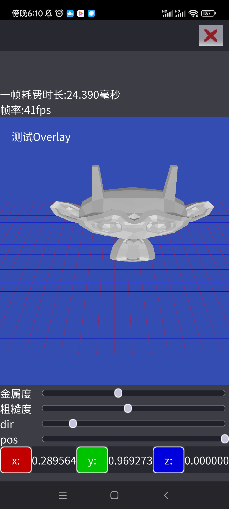
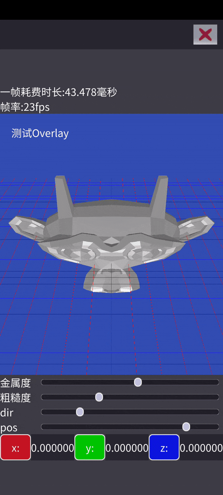

# GuGu

一个跨平台渲染器，支持android和windows。

# 特性

- 跨平台窗口、输入、渲染封装
- 渲染接口采用nvrhi，并且移植到了android
- 自绘GUI
- 渲染视口和GUI的整合

## 自绘GUI特性

- 纹理图集
- 背景板控件，支持单个子控件的布局
- 按钮控件
- 复选框控件
- 图片控件
- 圆角样式
- 滑条控件
- 微调控件(spin box)
- 视口控件
- 层叠布局控件
- 水平布局控件
- 垂直布局控件
- 可编辑文本框控件，暂时支持单行，支持剪切和复制(Windows)
- 事件分发机制，支持事件的冒泡
- 支持焦点和捕获路径
- 贝塞尔曲线
- 声明式语法构建UI树
- 合批
- 画刷
- 样式集合

- 键盘事件、鼠标事件、焦点事件的支持

# 展示

如下是演示的gif图

